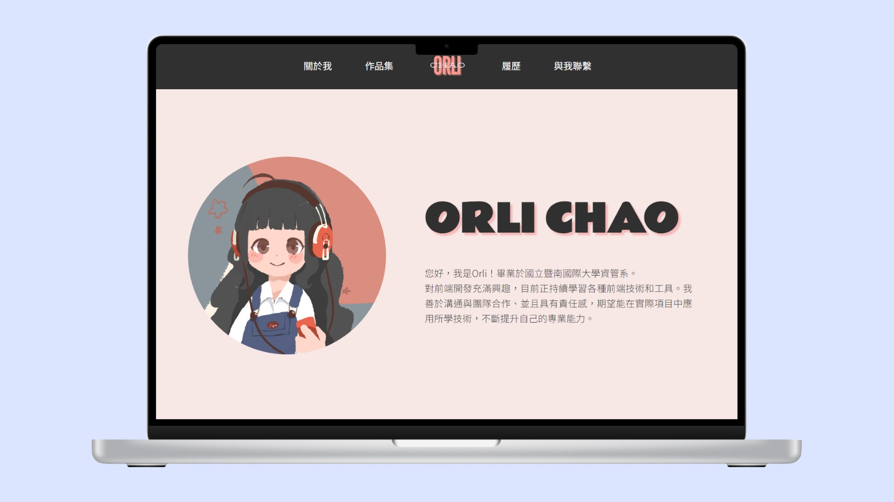
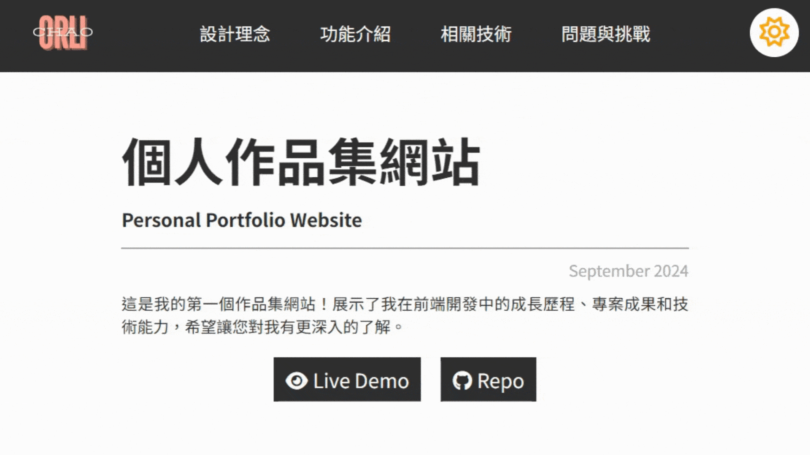

# Portfolio Website
[Demo](https://orli1022.github.io/portfolio-web/portfolio-web-intro.html)

This is my first portfolio website! It showcases my growth in front-end development, project achievements, and technical skills. I hope this gives you a deeper understanding of my work.

## Design Philosophy
The website features a minimalistic design with light pink and black as the primary colors, creating a professional look. It utilizes responsive web design (RWD) for a smooth experience on both desktop and mobile devices. The intuitive navigation and clear content hierarchy help visitors easily find information. A dedicated project page offers detailed visuals and descriptions of my work.

## Features

### 1. Card-style Project Showcase
The project list is designed in a card style, with each card indicating the technologies used in the projects. This allows visitors to quickly grasp the technical background of each project. The card design not only enhances visual hierarchy but also optimizes the interaction experience. Visitors can click on the cards to learn more about each project, providing a clean and smooth user experience.

### 2. Online Viewing and Downloading Resume
The resume section offers options for online viewing and downloading, making it convenient for visitors to access or save it at any time. Visitors can browse the resume directly on the website or use a cloud link to access detailed information. They can also download the resume in PDF format, ensuring data integrity and readability, which enhances the overall user experience.

### 3. Light/Dark Mode Toggle Design
The project introduction page supports a light/dark mode toggle, allowing visitors to choose their preferred browsing mode. The dark mode provides a softer visual effect, suitable for nighttime use, and adds a modern touch to the website. This feature offers a personalized visual experience, further improving the website's usability and friendliness.

### 4. Form Submission
To simplify the setup of the contact form, I chose to use Formspree to handle visitors' form submissions. This tool allows form content to be sent directly to my email without the need for backend server configuration, ensuring secure and quick data transmission.

## Technologies Used
- HTML
- CSS
- JavaScript
- Formspree.js
